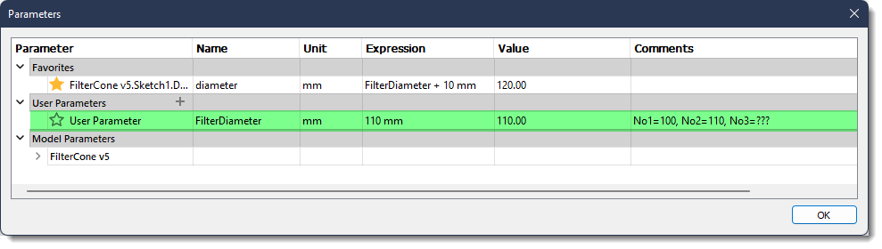

# V60FilterConeHolder

Tired of unfolding your filters and trying to get them settled into your V60. Store your V60 filters in their unfolded state so you're ready to make great coffee at a moment's notice! This holder will hold as many filters as you dare stack onto it. Store your V60 pourover device on top of the filter too. After a day or so of being stacked, the filters will assume their unfolded state and slide effortlessly into your pourover device, ready to be rinsed

## models/V60FilterConeHolder.f3d

This is a parameterized Fusion360 model file. You can configure the model for No1, No2, No3, or, really, any size you want, by changing the "FilterDiameter" parameter. This parameter is the diameter of the filter when unfolded, expressed in millimeters. The parameter entry in the table has nots on what diameters to use for common filter sizes.

You will also find 3MF files in the models folder.  These files are ready to drop into your slicer.

## gcode folder

This folder contains ready-to-print gcode files for various filter sizes.  

## stl folder

If you still use STL files, this is where you'll find them.
